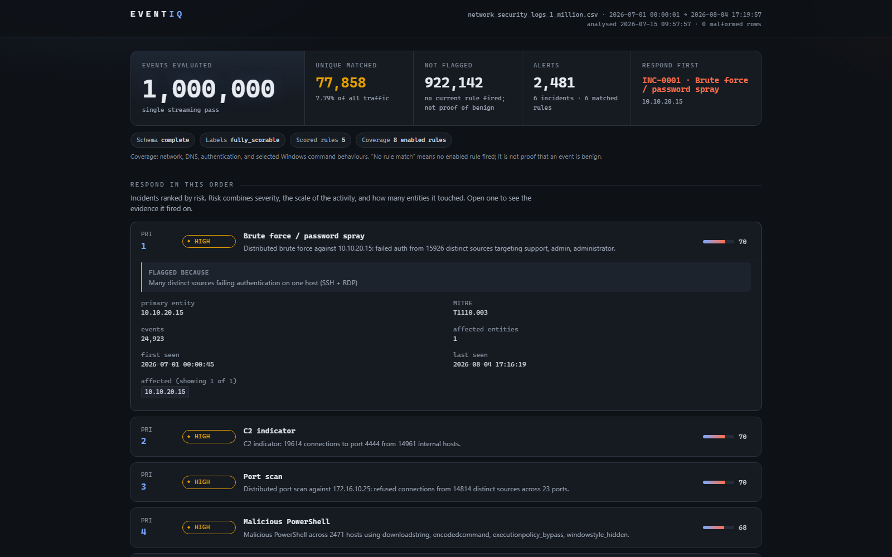
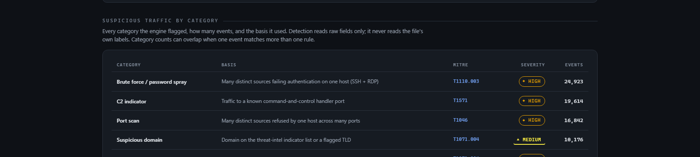
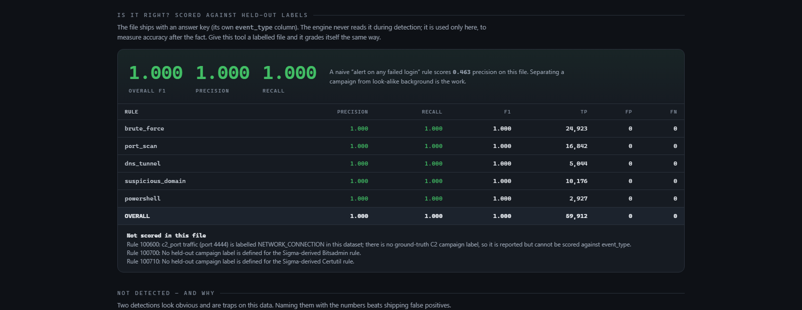

<div align="center">

# EventIQ

**A detection engine that never reads the answer key.**

Reads a million rows of raw network, authentication, DNS and system activity, finds the attacks hiding in them, ranks them by risk, and proves its own accuracy against labels it was never allowed to see during detection.

[](https://github.com/MuhammadIsmail009/eventiq/actions/workflows/ci.yml)
[](https://www.python.org/)
[](https://github.com/astral-sh/ruff)
[](https://mypy-lang.org/)
[](LICENSE)

[Quick start](#-quick-start) ·
[Results](#-results) ·
[Full report (PDF)](docs/report/eventiq-report.pdf) ·
[Dashboard preview](#-the-dashboard)

</div>

---

Built as a SOC internship project (Ebryx, blue team). The reference dataset is
one CSV of 1,000,000 rows spanning 35 days; reviewer uploads can use a smaller,
partial canonical schema.

<details>
<summary><b>Table of contents</b></summary>

- [The one idea that matters](#the-one-idea-that-matters)
- [Results](#-results)
- [The dashboard](#-the-dashboard)
- [What it finds, and how](#-what-it-finds-and-how)
- [What it refuses to build](#-what-it-refuses-to-build)
- [Quick start](#-quick-start)
- [Outputs](#-outputs)
- [Configuration](#-configuration)
- [How it is built](#-how-it-is-built)
- [Scaling note](#-scaling-note)
- [Development](#-development)
- [Project structure](#-project-structure)
- [Full report](#-full-report)
- [License](#-license)

</details>

## The one idea that matters

The input CSV ships with an `event_type` column that already names the attacks
(`PORT_SCAN`, `FAILED_LOGIN_BURST`, `DNS_TUNNELING`, and so on). Reading that
column and calling it detection proves nothing. So EventIQ never touches it.

The engine detects from raw observable fields only: IPs, ports, protocol,
service, username, status, domain, command, bytes. The `event_type` column is
held out and used for one purpose, to score precision, recall and F1 after the
fact. The `Event` object the detectors receive does not even have an `event_type`
field, and a test fails the build if any detector source so much as mentions it.

That is what makes the results below mean something.

## 📊 Results

Scored against the held-out labels on the full 1,000,000-row file:

| Rule | Precision | Recall | F1 | TP | FP | FN |
|---|---|---|---|---|---|---|
| brute_force | 1.000 | 1.000 | 1.000 | 24,923 | 0 | 0 |
| port_scan | 1.000 | 1.000 | 1.000 | 16,842 | 0 | 0 |
| dns_tunnel | 1.000 | 1.000 | 1.000 | 5,044 | 0 | 0 |
| suspicious_domain | 1.000 | 1.000 | 1.000 | 10,176 | 0 | 0 |
| powershell | 1.000 | 1.000 | 1.000 | 2,927 | 0 | 0 |
| **Overall** | **1.000** | **1.000** | **1.000** | **59,912** | **0** | **0** |

The number to compare against: a naive "alert on any failed login" rule scores
**0.463** precision on this file, because 28,889 background failed logins are not
part of the real campaign. Separating the distributed attack from that noise is
the actual problem, and it is why these detectors pivot the way they do.

Analysis runs in about **45 seconds** with peak memory under **150 MB**, because
it streams the file in a single pass. Memory is a function of how many entities
are active, not how big the file is.

## 🖥 The dashboard

<div align="center">

</div>

<details>
<summary>More of the dashboard: category breakdown and the accuracy check</summary>
<br>


<br><br>


</details>

## 🔍 What it finds, and how

The two big attacks in this data are distributed. The port scan comes from 14,814
different source IPs, the brute force from 15,926, and both are spread evenly
across all 35 days. The textbook rule "one source IP hits many ports in a minute"
finds nothing here, and a five-minute sliding window never accumulates enough to
fire. So detection pivots on the destination and counts how many distinct sources
converge on it over the whole batch.

- **Distributed port scan** (T1046): one host receiving refused connections from
  many distinct sources across many ports. Benign busiest host had 758 sources
  but zero refused; the scan target had 14,814, all refused.
- **Distributed brute force / spray** (T1110.003): one host receiving failed auth
  from an anomalous number of distinct sources, across SSH (22) and RDP (3389).
  Benign maximum was 28 sources on any host; the campaign had 15,926.
- **DNS tunneling** (T1071.004): a parent domain carrying subdomains that are at
  once high-entropy, long-labelled, and numerous. Shannon entropy alone would
  false-positive, so all three signals must agree.
- **Suspicious domains** (T1071.004): an indicator list plus a conservative
  bad-TLD net.
- **Malicious PowerShell** (T1059.001): encoded command, download cradle, hidden
  window, and execution-policy bypass patterns in the command field.
- **C2 indicator** (T1571): traffic to a known handler port (4444), rolled up
  into one finding with the internal hosts and external destinations ranked.
- **Sigma-derived Windows downloads** (T1105): conservative mappings of the
  official SigmaHQ Bitsadmin and Certutil download rules. The utility name and
  download arguments must occur together; ordinary list/hash commands stay quiet.

The 2,481 row-level alerts are correlated into **6 ranked incidents** so an
analyst reads a short list, not a wall.

<details>
<summary><b>Classic single-source detections</b> (for small, non-distributed logs)</summary>

<br>

The distributed rules above are tuned for a botnet-scale campaign. A real analyst
also uploads small logs where one attacker acts alone, and those never reach a
distributed threshold. So there is a second family of detectors that pivots on the
source inside a short sliding time window. They are additive: they use their own
rule IDs and thresholds, and on the 1M reference file they raise **zero** alerts,
because that file's attacks and its benign noise are both spread thin over 35 days
while these rules only fire on a burst. Every threshold sits above the measured
windowed benign ceiling of the 1M file.

- **Classic port scan** (100210, T1046): one source touching 10+ distinct ports of
  one host inside 5 minutes.
- **Classic brute force** (100110, T1110.001): one source failing auth 8+ times
  against one host inside 10 minutes.
- **Password spray** (100120, T1110.003): one source failing across 5+ distinct
  usernames in a window, or 7 to 49 distinct sources failing one account (above 49
  it is the distributed campaign, left to rule 100100).
- **Lateral movement** (100130, T1021): one source failing auth across 5+ distinct
  hosts on remote-service ports (SMB 445, RDP 3389, WinRM 5985/5986) in a window.

Malformed rows (a dropped column, a bad type) are counted and disclosed, never
silently kept: a file with garbled lines still analyzes its valid rows and reports
how many it skipped.

</details>

## 🚫 What it refuses to build

Two detections look obvious and are traps on this data. EventIQ names them with
the numbers instead of shipping false positives.

- **Exfiltration by byte volume is not viable.** The byte columns are uniform
  noise; the median total is about 3.5 MB for every event type, including DNS
  queries. A volume rule would rank random benign rows as the top exfil events.
- **Off-hours and beaconing are not viable.** Timestamps are uniform at about 4%
  of events per hour, 24 hours a day, with no periodic interval. There is no
  business-hours baseline and no beacon to recover.

Knowing your own false-positive modes is the job. Both appear in the report's
`not_detected` section and on the dashboard.

## 🚀 Quick start

```bash
python -m venv .venv && . .venv/Scripts/activate   # or .venv/bin/activate on Unix
pip install -e ".[dev]"

# analyze: JSON report, JSONL alert stream, HTML dashboard, and inline scoring
eventiq analyze network_security_logs_1_million.csv \
    -o report.json --jsonl alerts.jsonl --html dashboard.html --validate

# score an existing run against the held-out labels
eventiq validate network_security_logs_1_million.csv

# export deployable rules for the team's platform
eventiq export --wazuh eventiq_wazuh_rules.xml --sigma eventiq_sigma.yml

# render a dashboard from a saved report
eventiq render report.json -o dashboard.html

# reviewer mode: upload a compatible CSV in the browser and get its dashboard
eventiq serve
# then open http://127.0.0.1:8000
```

`serve` needs no Node and no `npm install`. The dashboard is a React app but its
built bundle is committed to `src/eventiq/web/`, so a clean clone serves it
straight off disk. The baked-in detection defaults are kept equal to
`config/default.yml`; pass `-c` only when you intentionally want another config.
See [Development](#-development) if you want to change the dashboard.

The upload page requires `timestamp`, `source_ip`, and `destination_ip` (or the
exact alias `dest_ip`). Other canonical fields are optional and are disclosed on
the dashboard when absent. Exact aliases `target_user` and `status` are accepted
for `username` and `event_status`; ambiguous files containing both names are
rejected. Missing `log_id` values receive deterministic row IDs.

`event_type` and `severity` are optional held-out label columns. Precision,
recall and F1 are shown only for supported campaign labels actually present in
the upload. Generic labels such as `LOGIN`, `DNS_QUERY`, or `system_event` do not
become an answer key merely because the column exists.

Exit codes compose into a pipeline: 0 clean, 1 when alerts at or above the
minimum severity fire, 2 on input or config error.

## 📦 Outputs

- **`report.json`** mirrors the Wazuh alert envelope (`rule.id`, `rule.level`,
  `rule.mitre`, `data.*`) and carries the incidents, per-entity risk, validation
  scores, and the two named traps. Same input plus same config gives byte-
  identical output apart from a stamped `generated_at`.
- **`alerts.jsonl`** is one alert per line, ingestible by Wazuh's JSON decoder.
- **`dashboard.html`** is a single self-contained file: no external requests, no
  executable JavaScript, no fonts CDN. It opens offline, so it
  attaches to a ticket and opens on a locked-down box. Its only `<script>` is a
  `type="application/json"` data island, so it survives a strict CSP. Verified,
  not asserted: `tests/unit/test_render_contract.py` fails if a subresource or an
  off-host URL ever appears in it.
- **Wazuh XML and Sigma YAML** translate the detections to the team's platform.
  The distributed and classic single-source detectors become Wazuh frequency
  rules (`same_srcip`/`different_dstport` and friends) and Sigma value_count /
  event_count correlations; the content detectors become field matches. The
  curated Sigma mapping and YARA boundary are documented in `docs/SIGMA-RULES.md`.

## ⚙️ Configuration

Every threshold, indicator list, rule level and MITRE mapping lives in
`config/default.yml`. No attack-specific constant (a target IP, a subnet) is
hardcoded in detection code; the detectors key on structure, and indicator lists
are threat intel fed to a rule. Unknown config keys are rejected rather than
silently ignored.

## 🏗 How it is built

```
CSV --> streaming reader (drops event_type/severity) --> Event
      --> AnalysisEngine (single pass, twelve enabled rules)
      --> Alerts --> risk scoring + incident correlation
      --> JSON report --> HTML dashboard | Wazuh XML | Sigma YAML
      --> validate (separate pass, reads the held-out labels, scores)
```

Pure standard library on the hot path. Dependencies are small: `jinja2` and
`pyyaml` for rendering and config. An optional Polars reader sits behind
`--engine polars` for raw speed, without forking the detection logic.

<details>
<summary><b>Two dashboards, one report</b> (why there are two renderers)</summary>

<br>

```
   build_report()  -->  report.json  (one schema)
                             |
          +------------------+------------------+
          |                                     |
  eventiq serve                          eventiq --html
  React + Framer Motion SPA              single self-contained file
  boot -> upload -> dashboard            no JS, opens offline,
  the interactive experience             attaches to a ticket
```

Both read `report.json` and nothing else, so neither can quietly disagree with
the other about what was detected. `tests/unit/test_render_contract.py` parses
the SPA's TypeScript types and asserts they match the keys `build_report()`
actually emits, so drift fails the test suite instead of surfacing in review.

The SPA is the nicer experience; the static export is the artifact that survives
being emailed. Detection never depends on either.

</details>

## 📈 Scaling note

Distinct-source counting is exact here and fits well under 150 MB, because there
are tens of thousands of active entities, not billions. The `.distinct` sets in
`windows.py` are the seam where a HyperLogLog sketch would go at 100x scale,
trading a little accuracy in the evidence counts for constant memory. That is a
deliberate non-goal for this dataset, called out rather than pre-built.

## 🛠 Development

```bash
pytest -q          # unit + integration, includes the no-label-leak guard
ruff check .
mypy src
```

<details>
<summary>Changing the dashboard SPA</summary>

<br>

Only needed if you touch anything under `web/`. Nothing else in the project
requires Node.

```bash
cd web
npm install
npm run dev       # hot reload; proxies /analyze to a running `eventiq serve`
npm test          # Vitest report-contract and rendering regression tests
npm run build     # emits the bundle into src/eventiq/web/
```

`npm run build` writes into `src/eventiq/web/`, and **that output is committed on
purpose**. It is what lets `eventiq serve` work from a clean clone with no Node
installed. If you change `web/` and do not rebuild and commit the bundle, the
served app will not match the source.

</details>

## 📁 Project structure

```
eventiq/
├── src/eventiq/          Detection engine, CLI, and the committed dashboard bundle
│   ├── detectors/        The six raw-field detectors
│   ├── export/            Wazuh XML + Sigma YAML generators
│   ├── render/            Jinja2 static dashboard renderer
│   └── web/               Built React SPA (served by `eventiq serve`)
├── web/                  React + Framer Motion dashboard source
├── config/default.yml    Every threshold, indicator list, and MITRE mapping
├── tests/                Unit + integration tests, incl. the no-label-leak guard
├── review-logs/          Small hand-built fixtures covering each detector shape
├── docs/
│   ├── SPEC.md            The brief, extracted requirements, and dataset profiling
│   ├── RESEARCH.md        Sourced Wazuh/Sigma/MITRE research
│   ├── PRD.md              Requirements and success criteria
│   ├── DESIGN.md           Dashboard visual design system
│   ├── SIGMA-RULES.md     Sigma/Wazuh export mapping and YARA scope decision
│   └── report/             LaTeX source + compiled PDF technical report
└── .github/workflows/     CI: ruff, mypy, pytest on every push
```

## 📄 Full report

A LaTeX writeup covering the dataset, the detection method, the validation
methodology, and the limitations lives at
[`docs/report/eventiq-report.pdf`](docs/report/eventiq-report.pdf)
([source](docs/report/eventiq-report.tex), builds clean on Overleaf or with
`tectonic`/`pdflatex`).

## 📜 License

MIT. See [`LICENSE`](LICENSE).
